# CEA Database Schema Relationships

This diagram shows the detailed structure and relationships between CEA database files.

## Database Relationship Diagram

```mermaid
graph TD
    %% Building Assignment Layer
    subgraph BuildingLayer["🏢 Building Assignment"]
        Building[Building] 
        ConstructionType["Construction Type<br/>STANDARD1-6"]
        UseType["Use Type<br/>OFFICE, HOTEL, etc."]
    end
    
    %% ARCHETYPES Layer
    subgraph ArchetypeLayer["📋 ARCHETYPES Layer"]
        CT["<table><tr><th colspan='2'>CONSTRUCTION_TYPES.csv</th></tr><tr><td>🔑 const_type</td><td>PK</td></tr><tr><td>year_start</td><td>Data</td></tr><tr><td>year_end</td><td>Data</td></tr><tr><td>🔗 type_wall</td><td>FK → ENVELOPE_WALL.code</td></tr><tr><td>🔗 type_roof</td><td>FK → ENVELOPE_ROOF.code</td></tr><tr><td>🔗 type_win</td><td>FK → ENVELOPE_WINDOW.code</td></tr><tr><td>🔗 hvac_type_hs</td><td>FK → HVAC_HEATING.code</td></tr><tr><td>🔗 hvac_type_cs</td><td>FK → HVAC_COOLING.code</td></tr><tr><td>🔗 supply_type_hs</td><td>FK → SUPPLY_HEATING.code</td></tr></table>"]
        UT["<table><tr><th colspan='2'>USE_TYPES.csv</th></tr><tr><td>🔑 use_type</td><td>PK</td></tr><tr><td>Tcs_set_C</td><td>Data</td></tr><tr><td>Ths_set_C</td><td>Data</td></tr><tr><td>Occ_m2p</td><td>Data</td></tr><tr><td>Qs_Wp</td><td>Data</td></tr><tr><td>El_Wm2</td><td>Data</td></tr><tr><td>Vww_ldp</td><td>Data</td></tr><tr><td>Vw_ldp</td><td>Data</td></tr></table>"]
    end
    
    %% ASSEMBLIES Layer
    subgraph AssemblyLayer["🔧 ASSEMBLIES Layer"]
        subgraph EnvelopeGroup["Envelope Systems"]
            EW["<table><tr><th colspan='2'>ENVELOPE_WALL.csv</th></tr><tr><td>🔑 code</td><td>PK</td></tr><tr><td>U_wall</td><td>Data</td></tr><tr><td>a_wall</td><td>Data</td></tr><tr><td>e_wall</td><td>Data</td></tr><tr><td>r_wall</td><td>Data</td></tr><tr><td>GHG_wall_kgCO2m2</td><td>Data</td></tr></table>"]
            ER["<table><tr><th colspan='2'>ENVELOPE_ROOF.csv</th></tr><tr><td>🔑 code</td><td>PK</td></tr><tr><td>U_roof</td><td>Data</td></tr><tr><td>a_roof</td><td>Data</td></tr><tr><td>Solar_roof</td><td>Data</td></tr></table>"]
            EWin["<table><tr><th colspan='2'>ENVELOPE_WINDOW.csv</th></tr><tr><td>🔑 code</td><td>PK</td></tr><tr><td>U_win</td><td>Data</td></tr><tr><td>SHGC_n</td><td>Data</td></tr><tr><td>F_F</td><td>Data</td></tr><tr><td>G_win</td><td>Data</td></tr></table>"]
        end
        
        subgraph HVACGroup["HVAC Systems"]
            HH["<table><tr><th colspan='2'>HVAC_HEATING.csv</th></tr><tr><td>🔑 code</td><td>PK</td></tr><tr><td>class_hs</td><td>Data</td></tr><tr><td>convection_hs</td><td>Data</td></tr><tr><td>Qhsmax_Wm2</td><td>Data</td></tr><tr><td>Tshs0_shu_C</td><td>Data</td></tr></table>"]
            HC["<table><tr><th colspan='2'>HVAC_COOLING.csv</th></tr><tr><td>🔑 code</td><td>PK</td></tr><tr><td>class_cs</td><td>Data</td></tr><tr><td>convection_cs</td><td>Data</td></tr><tr><td>Qcsmax_Wm2</td><td>Data</td></tr><tr><td>Tscs0_scu_C</td><td>Data</td></tr></table>"]
            HCtrl["<table><tr><th colspan='2'>HVAC_CONTROLLER.csv</th></tr><tr><td>🔑 code</td><td>PK</td></tr><tr><td>has_heating_season</td><td>Data</td></tr><tr><td>has_cooling_season</td><td>Data</td></tr></table>"]
        end
        
        subgraph SupplyGroup["Supply Systems"]
            SH["<table><tr><th colspan='2'>SUPPLY_HEATING.csv</th></tr><tr><td>🔑 code</td><td>PK</td></tr><tr><td>🔗 primary_components</td><td>FK → BOILERS.code</td></tr><tr><td>🔗 feedstock</td><td>FK → ENERGY_CARRIERS.code</td></tr><tr><td>efficiency</td><td>Data</td></tr><tr><td>CAPEX_USD2015kW</td><td>Data</td></tr></table>"]
            SC["<table><tr><th colspan='2'>SUPPLY_COOLING.csv</th></tr><tr><td>🔑 code</td><td>PK</td></tr><tr><td>🔗 primary_components</td><td>FK → CHILLERS.code</td></tr><tr><td>🔗 feedstock</td><td>FK → ENERGY_CARRIERS.code</td></tr><tr><td>efficiency</td><td>Data</td></tr><tr><td>CAPEX_USD2015kW</td><td>Data</td></tr></table>"]
            SDHW["<table><tr><th colspan='2'>SUPPLY_HOTWATER.csv</th></tr><tr><td>🔑 code</td><td>PK</td></tr><tr><td>🔗 primary_components</td><td>FK → BOILERS.code</td></tr><tr><td>🔗 feedstock</td><td>FK → ENERGY_CARRIERS.code</td></tr><tr><td>efficiency</td><td>Data</td></tr></table>"]
        end
    end
    
    %% COMPONENTS Layer
    subgraph ComponentLayer["⚙️ COMPONENTS Layer"]
        subgraph ConversionGroup["Conversion Equipment"]
            Boilers["<table><tr><th colspan='2'>BOILERS.csv</th></tr><tr><td>🔑 code</td><td>PK</td></tr><tr><td>type</td><td>Data</td></tr><tr><td>fuel_code</td><td>Data</td></tr><tr><td>cap_min</td><td>Data</td></tr><tr><td>cap_max</td><td>Data</td></tr><tr><td>min_eff_rating</td><td>Data</td></tr><tr><td>CAPEX</td><td>Data</td></tr></table>"]
            HeatPumps["<table><tr><th colspan='2'>HEAT_PUMPS.csv</th></tr><tr><td>🔑 code</td><td>PK</td></tr><tr><td>type</td><td>Data</td></tr><tr><td>source</td><td>Data</td></tr><tr><td>sink</td><td>Data</td></tr><tr><td>refrigerant</td><td>Data</td></tr><tr><td>capacity_cooling_nom_W</td><td>Data</td></tr></table>"]
            Chillers["<table><tr><th colspan='2'>CHILLERS.csv</th></tr><tr><td>🔑 code</td><td>PK</td></tr><tr><td>type</td><td>Data</td></tr><tr><td>technology</td><td>Data</td></tr><tr><td>cap_min</td><td>Data</td></tr><tr><td>cap_max</td><td>Data</td></tr><tr><td>COP_nominal</td><td>Data</td></tr><tr><td>CAPEX</td><td>Data</td></tr></table>"]
        end
        
        subgraph FeedstockGroup["Energy Carriers & Fuels"]
            EC["<table><tr><th colspan='2'>ENERGY_CARRIERS.csv</th></tr><tr><td>🔑 code</td><td>PK</td></tr><tr><td>type</td><td>Data</td></tr><tr><td>subtype</td><td>Data</td></tr><tr><td>qualifier</td><td>Data</td></tr><tr><td>unit_qual</td><td>Data</td></tr><tr><td>🔗 feedstock_file</td><td>FK → FEEDSTOCKS_LIBRARY</td></tr></table>"]
            FL["<table><tr><th colspan='2'>FEEDSTOCKS_LIBRARY/</th></tr><tr><td>🔑 filename</td><td>PK (NATURALGAS.csv, GRID.csv)</td></tr><tr><td>CO2_kgCO2MJ</td><td>Data</td></tr><tr><td>Price_m3</td><td>Data</td></tr><tr><td>LHV_MJm3</td><td>Data</td></tr><tr><td>density_kgm3</td><td>Data</td></tr></table>"]
        end
    end
    
    %% SCHEDULES Layer
    subgraph ScheduleLayer["📅 SCHEDULES Layer"]
        Schedules["<table><tr><th colspan='2'>SCHEDULES_LIBRARY/</th></tr><tr><td>🔑 filename</td><td>PK (OFFICE.csv, HOTEL.csv)</td></tr><tr><td>hour</td><td>Data</td></tr><tr><td>occupancy</td><td>Data</td></tr><tr><td>appliances</td><td>Data</td></tr><tr><td>lighting</td><td>Data</td></tr><tr><td>hot_water</td><td>Data</td></tr><tr><td>heating</td><td>Data</td></tr><tr><td>cooling</td><td>Data</td></tr></table>"]
        MM["<table><tr><th colspan='2'>MONTHLY_MULTIPLIERS.csv</th></tr><tr><td>🔑 use_type</td><td>PK</td></tr><tr><td>Jan</td><td>Data</td></tr><tr><td>Feb</td><td>Data</td></tr><tr><td>Mar</td><td>Data</td></tr><tr><td>Apr-Dec</td><td>Data</td></tr></table>"]
    end
    
    %% Connections
    Building --> ConstructionType
    Building --> UseType
    ConstructionType --> CT
    UseType --> UT
    
    %% Assembly Connections
    CT -->|type_wall| EW
    CT -->|type_roof| ER
    CT -->|type_win| EWin
    CT -->|hvac_type_hs| HH
    CT -->|hvac_type_cs| HC
    CT -->|hvac_type_ctrl| HCtrl
    CT -->|supply_type_hs| SH
    CT -->|supply_type_cs| SC
    CT -->|supply_type_dhw| SDHW
    
    %% Component Connections
    SH -->|primary_components| Boilers
    SH -->|primary_components| HeatPumps
    SC -->|primary_components| Chillers
    SH -->|feedstock| EC
    SC -->|feedstock| EC
    SDHW -->|feedstock| EC
    EC --> FL
    
    %% Schedule Connections
    UseType --> Schedules
    Schedules --> MM
    
    %% Styling
    classDef archetype fill:#e1f5fe,stroke:#01579b,stroke-width:2px
    classDef assembly fill:#f3e5f5,stroke:#4a148c,stroke-width:2px
    classDef component fill:#e8f5e8,stroke:#1b5e20,stroke-width:2px
    classDef schedule fill:#fff3e0,stroke:#e65100,stroke-width:2px
    
    class Building,ConstructionType,UseType,CT,UT archetype
    class EW,ER,EWin,HH,HC,HCtrl,SH,SC,SDHW assembly
    class Boilers,HeatPumps,Chillers,EC,FL component
    class Schedules,MM schedule
```

## Key Relationships

- **Buildings** are assigned construction types (STANDARD1-6) and use types (OFFICE, HOTEL, etc.)
- **Construction types** reference specific assemblies via foreign keys (type_wall → ENVELOPE_WALL.code)
- **Supply systems** reference specific equipment components and energy carriers
- **Use types** link to operational schedules that define hourly patterns
- **Energy carriers** connect to detailed feedstock libraries with emissions and cost data

## Usage

When working with CEA databases:
1. Start with building assignments to construction and use types
2. Follow foreign key relationships to find specific system configurations
3. Use the `code` fields as primary keys for most assemblies and components
4. Reference schedule libraries by filename matching use types