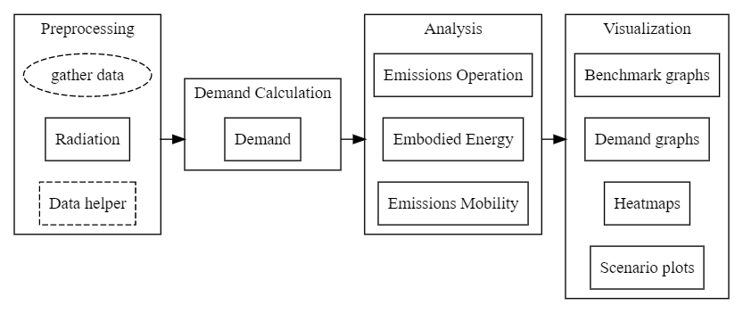

Getting started
===============

The City Energy Analyst V1.0b is stored in a public repository in Github
under the name of
`CEAforArcGIS <https://github.com/architecture-building-systems/CEAforArcGIS>`__.

The main workflow for working with the City Energy Analyst looks like
this:

Preprocessing
~~~~~~~~~~~~~

The *gather data* step will be different from project to project, but
usually involves collecting data from municipality databases, GIS
systems and in-person survey. The output is a set of shapefiles with the
building floor plans, floor heights and the corresponding building
program (usages).

The *Radiation* step calculates radiation data for the scenario.

The (optional) *Data helper* step aggregates archetype data to the
scenario for demand calculation.

Demand Calculation
~~~~~~~~~~~~~~~~~~

The *Demand* step calculates the load demands for heating and cooling
for a whole year. The output is used for the *Analysis* and
*Visualization* stages.

Analysis
~~~~~~~~

The *Analysis* stage contains three modules for analyzing various
aspects of the scenario: The emissions due to operation, embodied energy
of the built environment and emissions due to mobility.

Visualization
~~~~~~~~~~~~~

The *Visualization* stage creates visual representations of the data
obtained in the *Demand Calculation* and *Analysis* stages.

--------------

The repository is divided in the next folder structure:

The ``CEA`` folder
------------------

The folder ``cea`` stores the core of the City Energy Analyst. Access to
this folder is available to both contributors and normal users. Pulling
requests and merging activities are in principle limited to contributors
Level 3 and the board (`See team
conventions <./users_and_credentials.md>`__)

Contributors level 2 could create a pull request if their contribution
requires an explicit modification to ``cea``. For this,a branch under
the name of their contribution should be created first and then pushed
to master. the board will take a look and accept.

The ``CONTRIBUTIONS`` folder
----------------------------

The folder ``contributions`` stores contributions of developers level 2
and 3 after tested, documented and accepted by the board. Generally,
this is a plug-in/module/class created out of work in the Sandbox. These
contributions are presented in the form of a sub-folder structure like
``contributions/energystorage/simplewatertank/``. Developers level 2 and
3 o merge their contributions in the Master branch.

