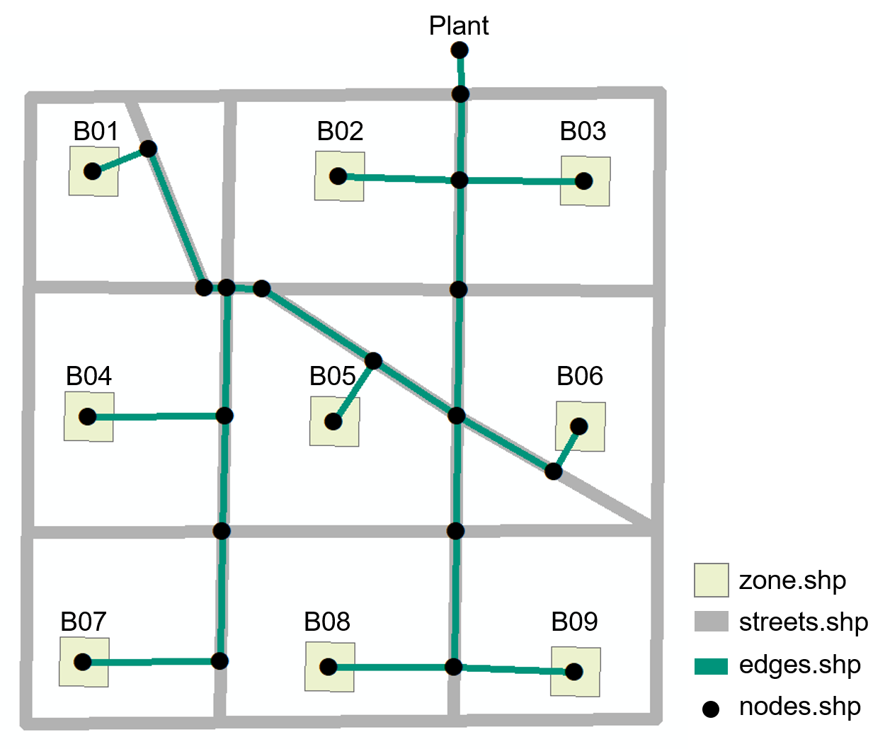

:orphan:

How to Prepare Inputs for Thermal Network Simulation
====================================================

The thermal network tool in CEA simulates thermal and hydraulic losses from network operation.
To run the simulation, two input files are required:

- ``edges.shp`` specifies the locations of pipes (edges). Each edge is a *straight* polyline and each end of the edge is connected to a node.
- ``nodes.shp`` specifies the locations of nodes, which represents the consumers, producers, intersections of streets, and connection points to consumers.

These files can be generated with the **Network Layout Tool** (cea>technologies>thermal_network>network_layout>main.py) or defined by users, in the later case, the users have to construct the two shape files in the following format:

Example network
---------------

Edges.shp
---------
.. image:: edges_shapefile.png
    :align: center

- **Shape**: Polyline (Geometry Type)
- **Type_mat (String)**: material of the pipes (default T1), more types can be found in databases>region>systems>thermal_networks.xls
- **Pipe_DN (String)**: 150 (this is an initial guess, it will be updated after the simulation).
- **Type (String)**: Pipe number, the number has to be exactly the same as the FID (use ``Field calculator`` in ArcGIS, type ``"PIPE"&[FID]``).

Nodes.shp
---------
.. image:: nodes_shapefile.png
    :align: center

- **Shape**: Point (Geometry Type)
- **Name (String)**: Node number, the number has to be exactly the same as the FID (use ``Field calculator`` in ArcGIS, type ``"NODE"&[FID]``).
- **Building (String)**: Building number as specified in ``zone.shp``, or else **NONE**.
- **Type (String)**: specify **CONSUMER** and **PLANT** nodes, the rest is **NONE**.

Where to store the file?
------------------------
The two shape files (``nodes.shp`` & ``edges.shp``) should be kept in either a **DH** (heating network) or **DC** (cooling network) folder under this path: ``your case study\inputs\networks``.
