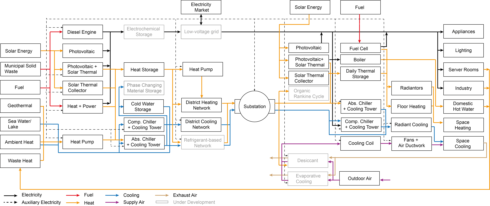

:orphan:

What is inside Energy Supply System Optimization in CEA?
========================================================
CEA provides a optimization tool to complete the analysis of a district.
This guide introduce the objectives and variables of the optimization, as well as steps run the tool.
This information can help the users to understand the results from the optimization.

Objectives
----------
This tool utilize genetic algorithms to identify energy supply system configurations that minimize the three
objectives:

- min. Costs: annualized capital costs and operational costs
- min. Emissions: annual green house gas emissions from the technology operation
- min. Primary Energy: annual primary energy consumptions

The results from the optimization is a collection of pareto-optimum solutions.

Optimization Variables
----------------------
Beside the objectives, the main outputs from the optimization is the energy supply system configurations.
Each pareto-optimum solution implies a unique energy supply system configuration. A configuration is combination of
energy supply technologies and sizes.
All possible configurations that is incorporated in the CEA is presented in this figure:

Supply technology selection and sizing
^^^^^^^^^^^^^^^^^^^^^^^^^^^^^^^^^^^^^^
Each perato-optimum solution includes a set of technologies that are installed, and the respective capacities.
The district scale technologies are connected to micro-grids or thermal networks to supply the energy to individual
buildings in a district.

Thermal network design
^^^^^^^^^^^^^^^^^^^^^^
Each perato-optimum solution also specify how many buildings are connected to a district heating or cooling network.
The main trade-off is between the capital expenditures on constructing the pipes and energy savings from using
centralized plants or utilizing on-site renewable energy potentials.
The buildings that are not connected to the thermal networks are supplied by decentralized technologies installed
at buildings.

Steps to Run The Tool
---------------------

#. Do Step 1, 2, 3, 5, 9 in :doc:`cea-workflow-guide`
#. Assign optimization `parameters <#Optimization-Parameters>`.
#. Run decentralized_building_main.py or the equivalent toolbox
#. Run optimization_main.py or the equivalent toolbox
#. Run multicriteria > main.py or the equivalent toolbox
#. Check results from optimization in ``...outputs/data/optimization/network/all_individuals.csv`` or using the
   plotting tools for optimization (Step 10 in :doc:`cea-workflow-guide`)

Optimization Parameters
-----------------------
For this optimization, the users can adjust four optimization parameters or use the default numbers.

- initialind: number of individuals. Default 3 individuals.
- halloffame: number of individuals to store in the hall of fame. Default 20 individuals.
- ngen: number of generations. Default 3 generations.
- fcheckpoint: frequency to save a checkpoint. Default 1 generation.
- maxtime: time to terminate the optimization if unfinished
- recoverycheckpoint = to resume the optimization from a check point.
- random-seed = Random seed to make it easy to replicate the results of the scenarios. Default 0.

These parameters are case-study dependent and need to be tuned based on the user requirement. The default values
provided are to act like a beacon in the research.

NOTE: As Genetic Algorithm, which is stochastic in nature, is being used as an optimization algorithm, the results
might not always be exact. So if there are 5 runs of the optimization, there is no guarantee that all 5 runs will
yield the same solution, but the solutions will be in close proximity. For example, if in a minimization problem, the
result in first run is 30056712, the second run might be 30045891 and the third run might be 30050025. But if the
results are normalized they are within 0.1% of the each other. An ideal way to run Genetic Algorithm is to do multiple
runs and take the best out of it and also note the worst result you might get from the optimization.

More on what's behind the scene
-------------------------------

Want to know how to understand the result files?
^^^^^^^^^^^^^^^^^^^^^^^^^^^^^^^^^^^^^^^^^^^^^^^^

There are tremendous amount of information that is generated through the optimization process.
Your go-to file to start with is `case study\optimization\slave\All_individuals.csv`. This files includes objectives
and variables of all individuals evaluated by the optimization.
To navigate through the rest of the files in the `case study\optimization` folder, please refer to :doc:`files-generated-by-the-cea`.

Want to know more about the master and slave structure?
^^^^^^^^^^^^^^^^^^^^^^^^^^^^^^^^^^^^^^^^^^^^^^^^^^^^^^^

This optimization follows a bi-level structure. In the master level, the configurations are determined, and the
slave level, the hourly operation is determined. To dig more into the structure of this optimization, please refer to
these `workflow diagrams`_.

.. _workflow diagrams: ./optimization_workflow/CEA-optimization-workflow.pdf

