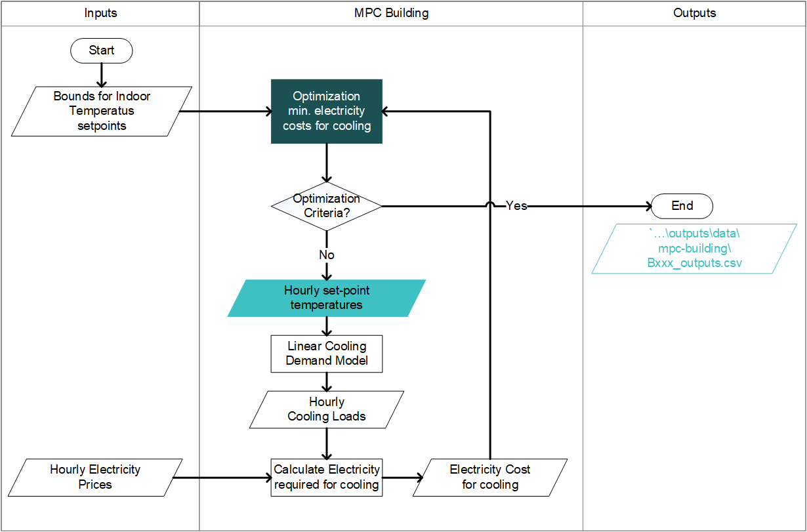

:orphan:

How to Run MPC Building Toolbox
===============================
The MPC Building Toolbox utilize Model Predictive Control (MPC) algorithms to minimize the electricity costs for cooling in buildings. When the hourly electricity prices are flunctuating, it is possible to explore the opportunities to shift the cooling loads by precooling the buildings (as shown in the figure below). 

.. image:: flexible_loads.png
      :width: 250
      :align: center
    

Input
-----
#. Range of the building temperature according to thermal comfort standard. 
#. Hourly electricity price. The database is located here: ``..\CityEnergyAnalyst\cea\databases\Region\systems\electricity_costs.xlsx``

Prerequisites
-------------
#. Install the license of Gurobi in your computer. you can obtain one in `gurobi.com
<http://www.gurobi.com/registration/download-reg>`_ for free for academic purposes.
#. Add Gurobi package to the cea environment::
   
   *open anaconda
   *do ``conda env update``
   *do ``activate cea``
   *do ``grbgetkey xxxxxxxxxxxxxxxxxxxxxxxxxxxxxx`` 
   (where xxxxxxxxxxxxxxxxxxxxxxxxxx is the key of your license.)
   
#. If you are having problems running from pycharm. get today's version 06.03.2019 or later one. This includes a fix to paths in conda.

Steps
-----
#. Assign optimization parameters in ``cea.config``::

      [mpc-building]
      time-start = 2005-01-01 00:00:00
      time-end = 2005-01-01 23:30:00
      *set-temperature-goal = constant_temperature, follow_cea, set_setback_temperature
      constant-temperature = 25.0; if the set-temperature-goal = constant_temperature
      *pricing-scheme = constant_prices, dynamic_prices
      constant-price = 255.2; [SGD/MWh]
      *min-max-source = constants, from occupancy, from building.py
      min-constant-temperature = 20.0
      max-constant-temperature = 25.0
      delta-set = 3.0; if min-max-source = from occupancy
      delta-setback = 5.0; if min-max-source = from occupany

#. Run `cea\optimization\flexibility_model\mpc_building\operation_main.py`
#. Check results from optimization in ``...scenario\outputs\mpc-building``

Outputs
-------
The results from the optimization are saved for each building. In ``Bxxx_outputs.csv`` you will find:

* Hourly temperature set-points for each function in the building
* Hourly air flows
* Hourly electricity consumption for cooling

Calculation flowchart
---------------------
** Please note: To maintain linearity, the cooling demand is calculated by a linearized model instead of the CEA demand module. 

