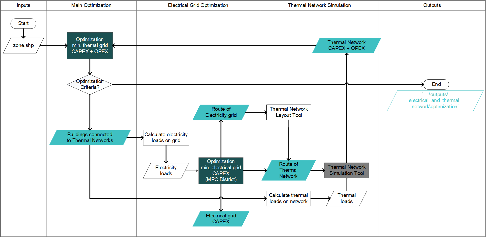

:orphan:

How to Run Thermal & Electrical Grid Planning in CEA.
=====================================================
Independently from the CEA optimization for energy systems, this tool aims to provide the thermal network route that
yields the lowest total costs from both thermal network and electrical grid.
This tool explores the trade-offs between the costs of thermal networks and electricity grid. When buildings are connected
to the thermal network, the loads on electricity grid is decreased.

Assumptions
-----------
#. For buildings connected to the thermal networks, the electricity loads include: lighting, appliance, and hot water.
#. For buildings disconnected to the thermal networks, the electricity loads include: cooling, lighting, appliance, and hot water.


Prerequisites
-------------
#. Install the license of Gurobi in your computer. you can obtain one in gurobi.com for free for academic purposes.
#. Add Gurobi package to the cea environment
   #.open anaconda
   #.do ``conda env update``
   #.do ``activate cea``
   #.do ``grbgetkey xxxxxxxxxxxxxxxxxxxxxxxxxxxxxx`` (where xxxxxxxxxxxxxxxxxxxxxxxxxx is the key of your license.)
#. If you are having problems running from pycharm. get today's version 06.03.2019 or later one. This includes a fix to paths in conda.


Steps
-----
#. Assign optimization parameters in ``cea.config``
#. Run `cea\optimization\flexibility_model\electric_and_thermal_grid_planning\electrical_thermal_optimization_main.py`
#. Check results from optimization in ``...scenario\outputs\electrical_and_thermal_network\optimization``


Outputs
-------
In the evaluation of each individual, all the following aspects of thermal network and electricity grid design are saved.
The results can be found in ``...scenario\outputs\electrical_and_thermal_network\optimization``

Individuals
^^^^^^^^^^^
The individuals generated are saved in `scenario\outputs\electrical_and_thermal_network\optimization\slave\geneneration_number`.

Thermal Network Design
^^^^^^^^^^^^^^^^^^^^^^
#. Buildings connected to thermal networks
#. Route
#. Pipe sizes
#. Annualized Capital costs (CAPEX) and Operation costs (OPEX)

Electricity Grid Design
^^^^^^^^^^^^^^^^^^^^^^^
#. Size of lines
#. Size of transformers
#. Size of substations
#. Annualized Capital costs (CAPEX) including operation and maintenance


Check Points
^^^^^^^^^^^^
When the optimization is interrupted, the intermediate results can be found in ```scenario\outputs\electrical_and_thermal_network\optimization\master``


Calculation flowchart
---------------------




Limitation
----------
#. The objective function only includes the costs of thermal networks. The costs of electrical grid should be included in the future.