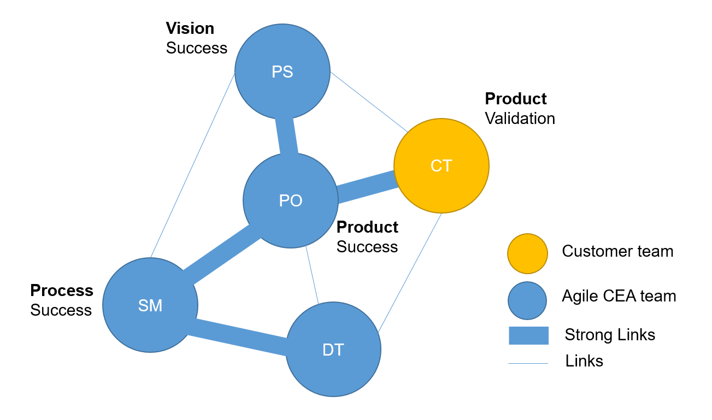

Roles and Responsabilities
==========================

by Dr. Jimeno A. Fonseca, 2020

This is a guide of roles and responsabilities in CEA. We use this to more formally coordinate our work.
To check who is currently holding each position, we invite you to check www.cityenergyanalyst.com/people for more information.

Product Sponsor (PS)
---------------------

The Project Sponsor is the person that has overall responsibility and accountability. His/her main responsabilities are:

1. Guarantee that our vision be successful by finding and securing the budget and ensuring that high-level organizational risks are mitigated.
2. Champion the project based on whether the work fits our research needs and overall strategy.
3. Empower the Product Owner to act for him/her on a more tactical basis.
4. Participate in Review events at least.

Product Owner (PO)
-------------------

The Product Owner is the voice of the customer and performs all tactical operations. His/her main responsabilities are:

1. Guarantee our product success by acting as a conduit/facilitator for communication between the team and the outside world.
2. Define and elaborate user stories while prioritizing the backlog and accepting work when the team completes a story.
3. Break down the overall vision into feasible and tactical pieces of work for the development team to understand and create.
4. Participate in Planning and Review events at least.

Scrum Master (SM)
-----------------

The Scrum Master is the servant leader and maintainer of agile practices. His/her main responsabilities are:

1. Guarantee the success of our processes by maintain all agile practices (including :doc:`activities`) and communication protocols between the Development team, the Product Owner and the Product Sponsor.
2. Be a servant leader, keeping the team out of distractions and empowering them to do their work with ease.
3. Support the Product Owner on setting priorities and grooming the backlog.
4. Nurture new and existing members of the Development Team.

Development Team (DT)
---------------------

The Development team is the group of individuals who build CEA. His/her main responsabilities are:

1. Create the best working software possible.
2. Design, analyze, develop, test and document new features in CEA.
3. Be Self-organized and self-directed.
4. Participate in all agile practices led by the Scrum Master.

Customer Team (CT)
---------------------

The Customer team is the group of individuals who use CEA. They are not part of the CEA team, but their function is extremely important for the succes of the project.

1. Represent one or more User Personas in CEA.
2. Validate CEA and give feedback to the Product Owner
3. Communicate issues and new features to the Product Owner.

