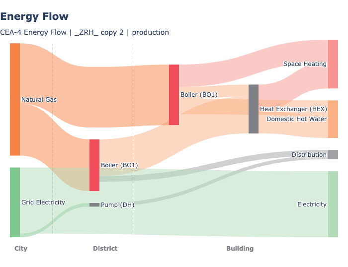
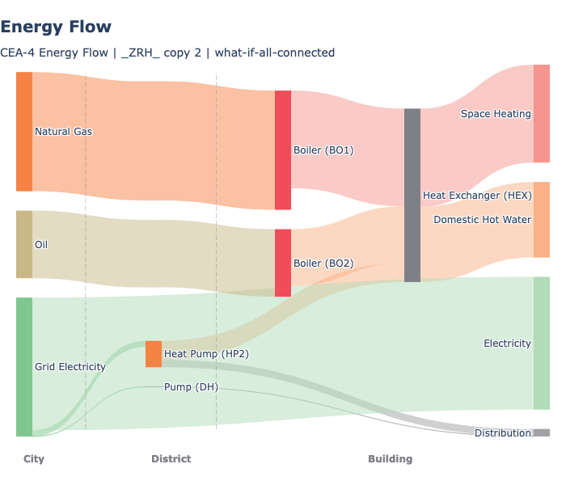
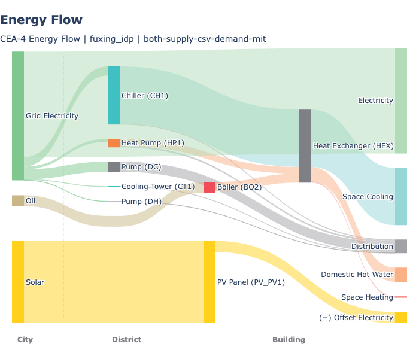
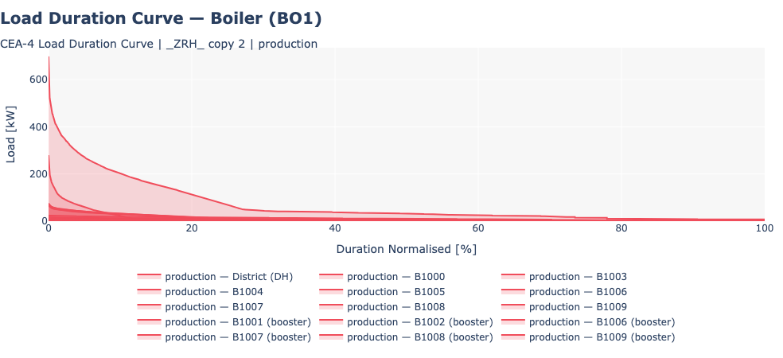

# Final Energy

## Overview

Calculates the final energy consumed by each building and district plant under a specific supply configuration (what-if scenario). Final energy is what the energy system actually consumes from carriers (grid electricity, natural gas, oil, coal, wood) to meet the building's energy demand.

## What It Calculates

For each **building**:
- Energy carrier consumption per service (heating, cooling, DHW, electricity)
- Conversion losses based on technology efficiency
- Booster energy for district-connected buildings

For each **district plant** (DH/DC):
- Primary and tertiary conversion energy
- Network pumping electricity

## Prerequisites

- **Energy Demand Part 2** completed
- **Solar Radiation** completed (if PV/PVT/SC are configured)
- **Thermal Network Part 1 + Part 2** completed (if district network scenarios are used)
- Building supply settings configured (Building Properties > Supply tab)

## Key Parameters

| Parameter | Description |
|-----------|-------------|
| **What-if name** | Name for this supply configuration scenario |
| **Network name** | Which thermal network layout to use (if applicable) |
| **Supply type (heating/cooling/DHW)** | Assembly codes for building and/or district scale |
| **Overwrite supply settings** | True to use what-if mode instead of production mode |
| **Connected buildings** | Override which buildings connect to the network |

## How to Use

1. **Configure supply systems** in Building Properties > Supply tab:
   - Set scale (BUILDING or DISTRICT) per service per building
   - Assign conversion technologies and carriers

2. **Run Final Energy**:
   - Navigate to **Life Cycle Analysis**
   - Select **Final Energy**
   - Enter a what-if scenario name
   - Select network layout (if buildings use district services)
   - Click **Run**

3. **Processing time**: 1-5 minutes for typical districts

## Output Files

All outputs are stored under `{scenario}/outputs/data/analysis/{what-if-name}/final-energy/`:

| File | Description |
|------|-------------|
| `configuration.json` | Full supply configuration (buildings + plants). Used by all downstream features. |
| `final_energy_buildings.csv` | Annual summary per entity (buildings + plants) |
| `{building_name}.csv` | 8,760-row hourly energy by carrier per building |
| `{plant_name}.csv` | 8,760-row hourly energy by carrier per plant |

## Understanding Results

- **Building-scale systems**: Final energy = demand / efficiency
- **District-connected buildings**: Show DH/DC as their carrier; actual fuel consumption is at the plant level
- **Plants**: Appear as separate rows with `type=plant`; their carrier consumption covers all connected buildings plus network losses and pumping
- **`configuration.json`**: Stores the complete supply configuration and is the sole source of truth for emissions, costs, and heat rejection

## Solar-thermal DHW dispatch (SC primary)

When a hot-water assembly uses a **flat-plate (`SC1`) or evacuated-tube
(`SC2`) solar collector as the primary component**, the Final Energy
feature runs an hourly tank-dispatch model instead of the usual "fuel =
demand / efficiency" shortcut.

### What the model does

1. Reads `Q_SC_gen_kWh` from the SC potential file, summing **only the
   `(surface, panel_type)` pairs configured for this building** (not the
   full panel-type aggregate — see [Solar Collectors output files](03-renewable-energy.md#output-files)).
2. Charges a single-node fully-mixed tank, sized at **50 L per m² of SC
   aperture** and initialised at the hour-0 cold-mains inlet temperature.
3. Serves DHW demand from the tank through a thermostatic mixing valve
   (setpoint 60 °C, the standard CEA `TWW_SETPOINT`). When the tank is
   below setpoint, the **secondary component** (BO/HP) tops up the gap.
4. Applies a Newton-style standing loss toward 20 °C ambient at 2%/hr.
5. Dumps surplus heat that would push the tank above 105 °C
   (pressure-relief cap).

### Assembly requirements

- `primary_component` must be an SC code (`SC1` or `SC2`).
- `secondary_component` is **required** — solar alone cannot cover
  24/7 DHW. Must be a boiler (`BO*`) or heat pump (`HP*`). The
  validator rejects assemblies without a backup.
- **PVT cannot be a DHW primary**. Its ~35 °C operating temperature is
  below the DHW setpoint and would need a stratified tank model to
  credit meaningfully. Configure an SC primary instead; PVT continues
  to offset space-heating emissions via the legacy path.

### Output columns (per-building `B####.csv`)

| Column | Meaning |
|---|---|
| `Qww_sys_SOLAR_kWh` | Hourly solar-delivered share of DHW (zero-emission carrier) |
| `Qww_sys_{backup}_kWh` | Hourly backup-carrier share (e.g. `Qww_sys_GRID_kWh` for an electric BO5 backup). Equals `served_by_backup_kwh / backup_efficiency`. |
| `Qww_sys_SOLAR_dumped_kWh` | Diagnostic: hourly heat discarded at the T_MAX=105 °C cap. Non-zero values flag an **oversized** SC for the DHW load. |
| `E_sys_GRID_kWh` | Includes SC pump parasitic (2% of delivered solar, added to the grid-electricity stream) |

The carrier-aggregation pipelines (summary CSV, emissions, costs,
visualisation) filter out `*_dumped_kWh` so it doesn't inflate totals.

### Known caveats

- **Oversizing is not a bug; it's visible**. If `area_SC_m2` is much
  larger than DHW demand justifies, the tank becomes large enough that
  standing losses dominate delivered heat. Check `Qww_sys_SOLAR_dumped_kWh`
  and the gap `Q_SC_gen − Qww_sys_SOLAR_kWh − Qww_sys_SOLAR_dumped_kWh`
  (standing loss) to diagnose.
- **Self-consistent T_cold bias**: The cold-mains inlet series used by
  both the demand side (`Qww_sys_kWh`) and the dispatch side comes from
  `cea.demand.hotwater_loads.calc_water_temperature`, which has a
  pre-existing units bug (uses hours where the Kusuda 1965 model expects
  seconds) that collapses the series to a constant. Real-world solar
  fractions in temperate climates are likely ~10% higher than the model
  reports. Tracked separately from this feature.

## Troubleshooting

| Issue | Solution |
|-------|----------|
| "Multiple district heating assembly types detected" | All district buildings must use the same assembly. Provide only one district assembly per service. |
| "District substation file not found" | Run thermal-network Part 2 before final-energy for scenarios with district connections. |
| "Component not found" | Check that ASSEMBLIES references valid COMPONENTS codes in the database. |

---

## Plot - Final Energy

### Overview
Creates bar charts of final energy consumption by carrier for buildings and plants.

### What It Shows
- Stacked bars per building showing carrier breakdown (Grid, Natural Gas, Oil, Coal, Wood)
- Plant entities shown with `-DH` or `-DC` suffix
- Multiple what-if scenarios can be compared side by side

### Key Parameters

| Parameter | Description | Options |
|-----------|-------------|---------|
| **What-if name** | Which scenario(s) to plot | Multi-select from available |
| **Y metric** | Which carrier(s) to show | Grid electricity, Natural gas, Oil, Coal, Wood |
| **Y unit** | Energy unit | MWh, kWh, Wh |
| **Normalise by** | Normalisation | None, Gross floor area, Conditioned floor area |
| **X axis** | View type | By building, by month, by season, district hourly, etc. |
| **Include** | Entity filter | Buildings, Plants, or both |

### Examples

Two what-if scenarios (Config 1 and Config 2) showing different supply configurations for the same district:

A more complex scenario with district heating, district cooling, and solar:

Load duration curve showing the same component (BO1) across district plant, standalone buildings, and boosters:

### Chart Interpretation

- **Energy flow sankey** shows carrier flows from city-level sources through district and building equipment to end-use services
- **Load duration curve** shows the hourly load profile of a component sorted by magnitude, useful for equipment sizing and utilisation analysis

---

## Related Features
- **[Emissions](06-2-emissions.md)** - Uses final energy to calculate operational emissions
- **[System Costs](06-3-system-costs.md)** - Uses final energy to calculate operational costs
- **[Heat Rejection](06-4-heat-rejection.md)** - Uses final energy to calculate waste heat

---

[<- Back: Life Cycle Analysis](06-0-life-cycle-analysis.md) | [Back to Index](index.md) | [Next: Emissions ->](06-2-emissions.md)
