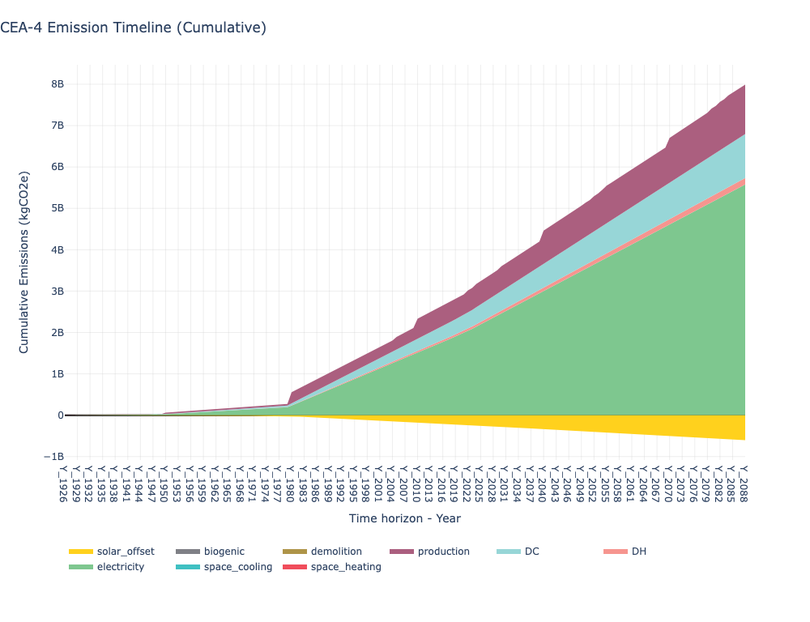

# Emissions

## Overview

Calculates greenhouse gas emissions for each building and district plant across the full building lifecycle. Produces both **lifecycle emissions** (embodied + operational over the building's lifespan) and **operational emissions** (hourly emissions from energy system operation).

## What It Calculates

**Embodied (Production) Emissions** (kgCO2e):
- Building envelope construction (walls, roof, floor, windows)
- Technical systems (HVAC equipment)
- PV/PVT/SC panel manufacturing (if configured)

**Operational Emissions** (kgCO2e):
- Per energy carrier (grid electricity, natural gas, oil, coal, wood)
- Per service (space heating, space cooling, DHW, electricity)
- District heating and district cooling (including pumping)
- Hourly timesteps (8,760 hours)

**Biogenic Carbon** (kgCO2e, negative):
- Carbon stored in timber and bio-based building materials

**Demolition Emissions** (kgCO2e):
- End-of-life processing at the building's demolition year

**Solar Offset Emissions** (kgCO2e, negative):
- Grid emissions avoided by on-site PV/PVT/SC generation

**Lifecycle Timeline**:
- Year-by-year emissions from construction year through demolition
- Supports grid decarbonisation projections

## Prerequisites

- **Final Energy** completed for the what-if scenario
- Solar radiation data (for PV-related embodied emissions)
- Zone geometry and building properties

## Key Parameters

| Parameter | Description |
|-----------|-------------|
| **What-if name** | Which final-energy scenario to calculate emissions for |
| **Grid decarbonisation reference year** | Base year for grid emission factor (optional) |
| **Grid decarbonisation target year** | Target year for reduced grid emissions (optional) |
| **Grid decarbonisation target emission factor** | Target kgCO2/kWh at target year (optional) |
| **Grid carbon intensity dataset CSV** | External 8760-row hourly grid intensity file (optional) |

## How to Use

1. **Run Final Energy** first for the what-if scenario

2. **Run Emissions**:
   - Navigate to **Life Cycle Analysis**
   - Select **Emissions**
   - Select the what-if scenario
   - Optionally configure grid decarbonisation trajectory
   - Click **Run**

3. **Processing time**: 2-10 minutes for typical districts

## Output Files

All outputs are under `{scenario}/outputs/data/analysis/{what-if-name}/emissions/`:

| File | Description |
|------|-------------|
| `emissions_buildings.csv` | Per-entity lifecycle totals (production, operation, biogenic, demolition) |
| `emissions_operational.csv` | District-level hourly operational emissions (8760 rows) |
| `emissions_timeline.csv` | District-level yearly lifecycle timeline |
| `operational/{building}.csv` | Per-building 8,760-row hourly operational emissions |
| `timeline/{building}.csv` | Per-building yearly lifecycle timeline |

## Understanding Results

- **Buildings using DH/DC** show zero operational emissions at building level; actual emissions appear on the plant row as district heating/cooling emissions
- **`emissions_buildings.csv`** contains lifecycle totals (operation column sums the full lifecycle, not a single year)
- **Timeline files** show year-by-year breakdown, useful for tracking trajectories toward net-zero
- **Grid decarbonisation** linearly interpolates emission factors between reference and target years, reducing operational grid emissions over time

## Troubleshooting

| Issue | Solution |
|-------|----------|
| Very high embodied emissions | Check material quantities in architecture file are realistic |
| Zero operational emissions | Ensure final-energy calculation completed; check supply systems are defined |
| Missing biogenic carbon | Verify timber content in architecture file; check database includes biogenic factors |

---

## Plot - Lifecycle Emissions

### Overview
Creates stacked bar charts showing total lifecycle emissions per building, combining embodied, operational, biogenic, demolition, and solar offset categories.

### What It Shows
- Positive bars: operational emissions by service + embodied (production, demolition)
- Negative bars: biogenic carbon, PV/PVT/SC offsets
- Title includes the lifecycle year range (e.g. "CEA-4 Lifecycle Emissions (1926 - 2088)")
- Net-zero buildings show positive and negative bars roughly equal

### Key Parameters

| Parameter | Description | Options |
|-----------|-------------|---------|
| **What-if name** | Which scenario(s) to plot | Multi-select |
| **Y unit** | Emission unit | kgCO2e, tCO2e |
| **Normalise by** | Normalisation | None, Gross floor area |
| **Include** | Entity filter | Buildings, Plants, or both |

### Example

### Legend Labels

| Legend Name | Meaning |
|-------------|---------|
| Electricity | Grid electricity operational emissions |
| Space Heating | Heating system operational emissions |
| Space Cooling | Cooling system operational emissions |
| Domestic Hot Water | DHW system operational emissions |
| District Heating | DH plant operational emissions (incl. pumping) |
| District Cooling | DC plant operational emissions (incl. pumping) |
| Production | Embodied construction emissions |
| Biogenic | Carbon stored in bio-based materials (negative) |
| Demolition | End-of-life emissions |
| PV Offset | Grid emissions avoided by PV (negative) |

---

## Plot - Emission Timeline

### Overview
Visualises how cumulative emissions evolve over time across the district, tracking the trajectory from construction through demolition.

### What It Shows
- Cumulative stacked area chart over the lifecycle year range
- Construction spikes (embodied), steady operational accumulation, demolition at end-of-life

### Example

### Key Parameters

| Parameter | Description | Options |
|-----------|-------------|---------|
| **What-if name** | Which scenario to plot | Single select |
| **Y unit** | Emission unit | kgCO2e, tCO2e |

---

## Plot - Operational Emissions

### Overview
Creates bar charts of operational emissions from energy system operation, with breakdowns by service and/or energy carrier.

### What It Shows
- Per-building operational emissions (annual or time-series)
- Breakdown by service or by carrier
- Solar offset emissions (shown as negative)

### Example

### Key Parameters

| Parameter | Description | Options |
|-----------|-------------|---------|
| **What-if name** | Which scenario(s) to plot | Multi-select |
| **Y category** | Breakdown type | By operation (service), by energy carrier, or both |
| **Y unit** | Emission unit | kgCO2e, tCO2e |
| **Normalise by** | Normalisation | None, Gross floor area |
| **X axis** | View type | By building, by month, district hourly, etc. |
| **Include** | Entity filter | Buildings, Plants, or both |

---

## Related Features
- **[Final Energy](06-1-final-energy.md)** - Prerequisite (must run first)
- **[System Costs](06-3-system-costs.md)** - Economic analysis of the same what-if scenario
- **[Heat Rejection](06-4-heat-rejection.md)** - Environmental heat impact
- **[Visualisation](10-visualisation.md)** - Additional plotting tools

---

[<- Back: Final Energy](06-1-final-energy.md) | [Back to Index](index.md) | [Next: System Costs ->](06-3-system-costs.md)
